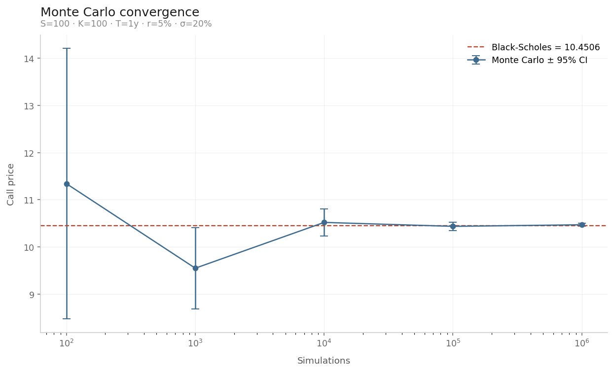
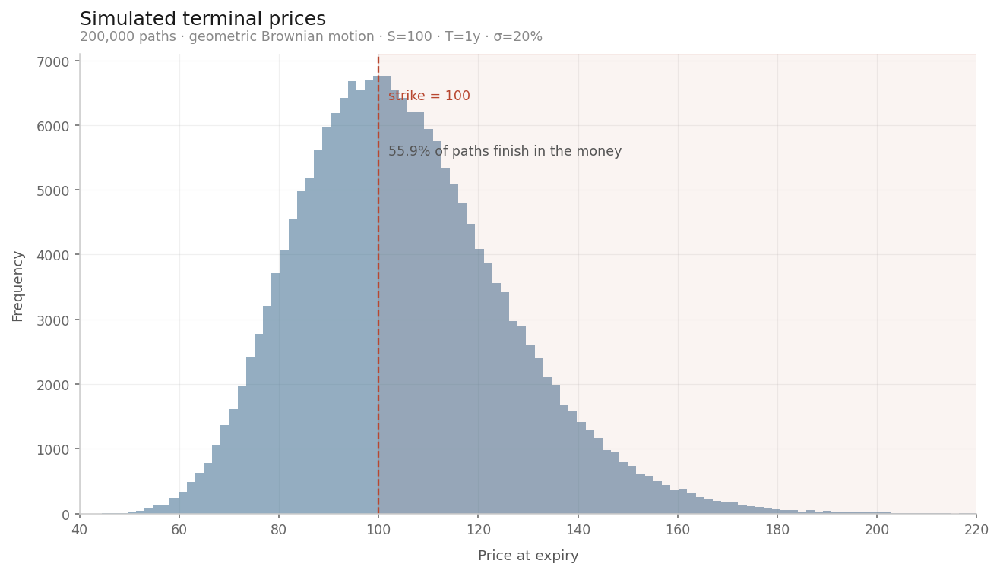

# Options Pricer: Black-Scholes vs Monte Carlo

European option pricing implemented two independent ways — closed-form Black-Scholes and Monte Carlo simulation — with convergence analysis, Greeks, and an examination of where the simulation method degrades.

The two implementations share no code. Agreement between them is the validation.

## Method

1. **Black-Scholes closed form** for European calls and puts.
2. **Put-call parity check** (C − P = S − Ke^−rT), a model-free no-arbitrage identity that catches implementation errors.
3. **Monte Carlo** under risk-neutral geometric Brownian motion: simulate terminal prices, apply the payoff, discount, average. Reported with standard error.
4. **Convergence study** from 10² to 10⁶ paths against the analytic price.
5. **Greeks** derived analytically: delta, gamma, vega, theta, rho.
6. **Accuracy at extreme strikes**, where the simulation estimator degrades.

## Validation

Baseline: S = 100, K = 100, T = 1y, r = 5%, σ = 20%

| | Call | Put |
|---|---|---|
| Black-Scholes | 10.4506 | 5.5735 |

Put-call parity holds to six decimal places (4.877058 both sides).

Monte Carlo at 100,000 paths: **10.4362 ± 0.0912** (95% CI). The analytic price falls inside the interval; difference −0.0144.

Error falls as 1/√n: a 100× increase in simulations yields roughly a 10× gain in precision. This is the fundamental cost of Monte Carlo and the reason closed-form solutions are preferred wherever they exist. At 100 paths the 95% interval spans 8.5–14.2; by 10⁶ it is visually indistinguishable from the analytic value.

## Greeks

| Greek | Value | Interpretation |
|---|---|---|
| Delta | +0.6368 | price change per $1 move in the underlying |
| Gamma | +0.0188 | rate of change of delta |
| Vega | +0.3752 | price change per 1pp change in volatility |
| Theta | −0.0176 | daily time decay |
| Rho | +0.5323 | price change per 1pp change in rates |

Delta exceeds 0.5 despite the option being at the money in spot terms: with T = 1y and r = 5%, the forward price is ≈105, so the option is in the money on a forward basis.

## Where Monte Carlo degrades

Relative error against the analytic price, 200,000 paths:

| Strike | BS price | Relative error |
|---|---|---|
| 150 | 0.35963 | −0.02% |
| 175 | 0.04433 | +4.79% |
| 200 | 0.00480 | +9.92% |

Accuracy depends on how frequently the payoff is non-zero, not on path count alone. Deep out of the money, nearly every path expires worthless and the estimate rests on a small number of extreme draws. Importance sampling — biasing draws toward the payoff region — is the standard remedy.

The lognormal terminal distribution shows why: the mass of paths falls well short of distant strikes.

## A note on reproducibility

An initial strike sweep produced positive pricing differences at all thirteen strikes. This was an artefact of a fixed random seed shared across strikes, not bias in the estimator. Varying the seed at a single strike produces differences of both signs (+0.0139, −0.0513, −0.0208, −0.0010, +0.0541), confirming the estimator is unbiased. Fixed seeds aid reproducibility but can produce systematic-looking artefacts across parameter sweeps.

## Limitations

- European exercise only; American options require binomial trees or Longstaff-Schwartz.
- Constant volatility and constant rates, per Black-Scholes assumptions. Real markets exhibit a volatility smile.
- Terminal-value simulation only; path-dependent payoffs (Asian, barrier) would require full path generation.
- No dividends.

## Possible extensions

Implied volatility solver by Newton-Raphson; volatility smile construction from market quotes; antithetic variates and control variates for variance reduction; binomial trees for American exercise; Heston stochastic volatility.

## Running it

Open `options_pricer.ipynb` in Google Colab and run the cells in order. Requires `numpy`, `scipy`, `matplotlib`.
